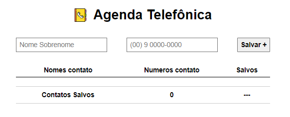

# Projeto 02: Agenda Telefônica

#### Requisitos proposto: 

- 1) Construa uma tabela com duas colunas:
nome e telefone

- 2) Construa um formulário no qual o usuário irá inserir o nome e telefone do contato e, ao clicar em cadastrar, uma linha será adicionada na tabela de contatos.

- 3) Publique a aplicação na Vercel. Para isso será necessário criar um repositório no Github e alimentá-lo com o código do projeto;

#### Sobre a atividade:

- Fiz algumas validações para deixar ainda mais completa a agenda e evitar bugs
- 1) Validação de nome e sobrenome do campo input para que não cadastre contatos com nomes iguais ou sem colocar o sobrenome pois com apenas 1 nome pode ser que tenha contato com nomes iguais, mais com sobre nome é possivel separar.
 - 2) Validação do campo numero telefone para que não ultrapasse 11 digitos, sendo possivel salvar o numero com ou sem o DD ((DD) 9 0000-0000) ou (9 0000-0000).
 - 3) Avisos de campos inputs preenchidos errados, os campos da o feedback caso os dados preenchidos não correspondem aos requisitos basico necessário para cadastro.

##

Clique para acessar "Agenda telefônica" 👇

    <a href="">
        </img>
    </a>

